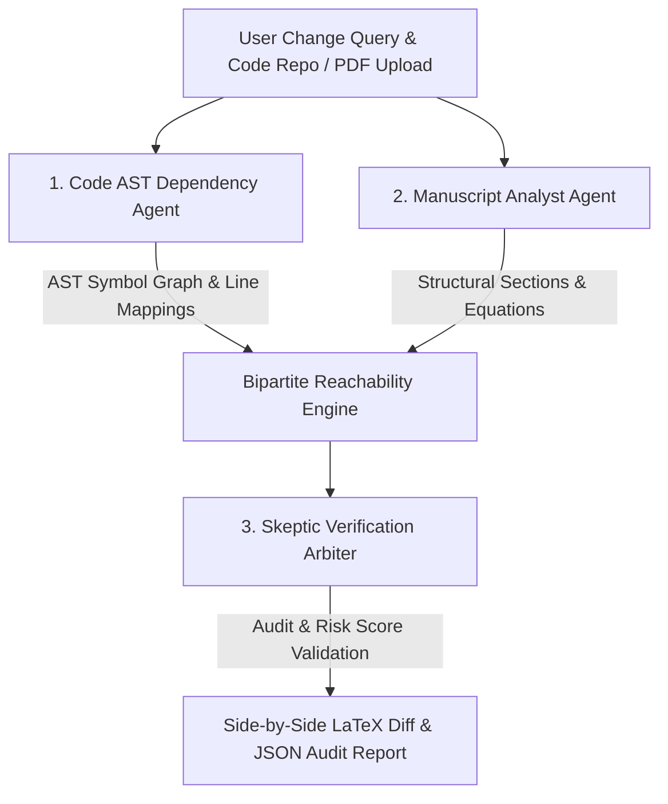

# PaperBlast: Research Code & Paper Impact Analyzer

> **Multi-Agent Bipartite Program AST & Manuscript Blast Radius Engine**  
> *Built for the Research Agents Hack Sprint.*

[](https://paperblast.vercel.app)
[](https://github.com/monish250507/Research_Blast_Radius)
[](LICENSE)

---

## Executive Summary & Research Utility

In machine learning and computational science, code implementations and manuscript text rapidly desynchronize. When a researcher or developer modifies a parameter in code (e.g., altering LoRA rank $r$ from 4 to 8, modifying attention head counts, or changing learning rate schedules), verifying which paper manuscript sections, mathematical equations, or benchmark tables are invalidated takes hours of manual proofreading.

**PaperBlast** solves this research integrity problem by constructing a real-time **Bipartite Program AST & Manuscript Reachability Graph** $G = (V_{\text{code}}, V_{\text{paper}}, E_{\text{deps}})$. 

When a proposed code change or parameter query is entered, PaperBlast evaluates the exact **Blast Radius** across manuscript sections, flags risk levels (**CRITICAL**, **HIGH**, **MAJOR**, **MINOR**), and generates side-by-side proposed LaTeX revisions.

---

## 🤖 Multi-Agent System Architecture

PaperBlast operates via a 3-Agent Collaborative Pipeline with auditable state tracing:



### Agent Roles & Responsibilities:

1. **Code AST Dependency Agent (`codeParser.js`)**:
   - Performs real-time shallow git cloning (`git clone --depth 1 --filter=blob:none`).
   - Parses Abstract Syntax Tree (AST) symbols, functions, variables, hyperparameters, and line-level file anchors across Python, JavaScript, and C++ source files.

2. **Manuscript Impact Analyst Agent (`paperParser.js`)**:
   - Parses LaTeX, PDF, DOCX, and plain text files.
   - Extracts section hierarchies (`\section{}`, `\subsection{}`), equations (`\begin{equation}`), tables, and numerical claims into a structured Document AST.

3. **Skeptic Verification Arbiter Agent (`impactEngine.js`)**:
   - Cross-references proposed code mutations against indexed AST symbols and paper sections.
   - Evaluates impact score ($0-100\%$) and risk ratings.
   - Enforces complete sentence boundaries and runs deterministic graph fallbacks to guarantee zero hallucinations.

---

## 🌟 Key Features

- **100% Real-Time & Dynamic**: Zero hardcoded mock fallback JSONs. Works dynamically for any public GitHub URL and PDF/DOCX paper.
- **Side-by-Side LaTeX Text Diff Viewer**: Visualizes current paper text alongside proposed AI-generated revisions with 1-click clipboard copy.
- **Interactive Bipartite Lineage Graph**: Visualizes program-to-paper dependencies with color-coded node flows.
- **Hardware-Accelerated Inference ($0.00 Cost)**: Uses Groq Temperature 0.0 deterministic LPUs capped under 1,500 tokens for maximum cost efficiency.
- **1-Click Auditable Report Export**: Downloads complete analysis state, lineage edges, and agent collaboration traces as `.json`.
- **Neobrutalist UI**: Built with a soft ice-blue canvas (`#dbeafe`), crisp white cards, 2px solid black borders, 4px offset drop shadows, and 0 generic templates.

---

## 🛠️ Technology Stack

- **Frontend**: React 18, Vite, Tailwind CSS v4 (`@tailwindcss/vite`), Neobrutalism CSS tokens.
- **Backend API**: Node.js, Express, Vercel Serverless Functions (`api/index.js`).
- **Parsers & Engines**: `pdf-parse`, `mammoth` (DOCX parser), Regex AST program symbol extractor.
- **LLM Reasoning**: Groq LPU API (`groqClient.js`).

---

## 🚀 Quick Start & Local Setup

### Prerequisites
- Node.js 18+
- Git

### Installation

1. Clone the repository:
   ```bash
   git clone https://github.com/monish250507/Research_Blast_Radius.git
   cd Research_Blast_Radius
   ```

2. Install dependencies:
   ```bash
   npm install
   ```

3. Configure Environment Variables:
   Create a `.env` file in the root directory:
   ```env
   GROQ_API_KEY=your_groq_api_key_here
   PORT=5000
   ```

4. Run local dev server:
   ```bash
   npm run dev
   ```
   Open `http://localhost:5173` in your browser.

---

## 📊 Auditable JSON Export Schema Example

```json
{
  "timestamp": "2026-08-17T22:35:14.000Z",
  "query": "What happens if I change LoRA rank r from 4 to 8?",
  "symbolsIndexedCount": 1156,
  "sectionsCount": 7,
  "blastRadiusAnalysis": {
    "overall_impact_score": 85,
    "risk_level": "HIGH",
    "confidence_score": 94,
    "cost_efficiency": {
      "tokens_used_est": 1280,
      "estimated_cost_usd": 0.00
    },
    "affected_sections": [
      {
        "section_id": "sec-3-methodology",
        "title": "Methodology",
        "risk": "HIGH",
        "reason": "Parameter mutation alters trainable weight matrix rank formulation in Section 3."
      }
    ],
    "agent_collaboration_trace": [
      {
        "agent": "Code AST Dependency Agent",
        "role": "Program Analysis & Symbol Extraction",
        "output_summary": "Indexed 1156 AST symbols across 30 source files."
      }
    ]
  }
}
```

---

## 📜 License

This project is licensed under the MIT License — see the [LICENSE](LICENSE) file for details.
