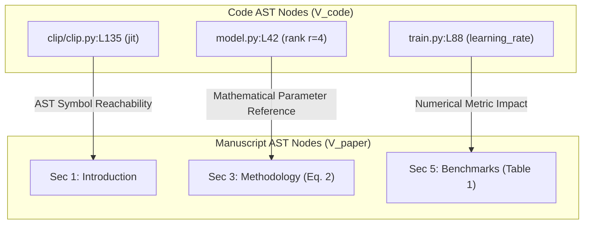
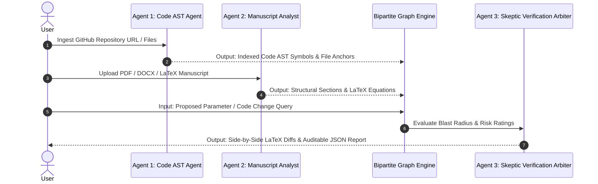

# PaperBlast: Research Code & Paper Impact Analyzer

> **Multi-Agent Bipartite Program AST & Manuscript Blast Radius Engine**  
> *Built for the Research Agents Hack Sprint.*

[](https://paperblast.vercel.app)
[](https://github.com/monish250507/Research_Blast_Radius)
[](LICENSE)

---

## 🌍 The Real-World Problem

In modern machine learning, AI research, and computational sciences, **source code implementations and paper manuscripts rapidly desynchronize**.

When researchers refine code prior to publication or during peer review:
1. **Silent Paper Invalidation**: A developer alters a hyperparameter (e.g., changing LoRA rank $r$ from 4 to 8, modifying FlashAttention block sizes, or adjusting weight decay schedules), but forgets that Section 3 ("Methodology") specifically claims an exact trainable parameter budget derived from $r=4$.
2. **Mathematical Contradictions**: Modifying a function signature or tensor shape in PyTorch/JS code silently breaks mathematical formulations and equations defined in Section 4 ("Theoretical Bounds").
3. **Reproducibility Failure**: External researchers attempting to reproduce paper results encounter discrepancies because the published codebase does not match the manuscript's claims.
4. **Hours of Manual Proofreading**: Reviewing a 15-page paper against 5,000 lines of code after every minor parameter tweak takes hours of painstaking, error-prone manual verification.

### How PaperBlast Solves It
**PaperBlast** automates paper-code synchronization by constructing a real-time **Bipartite Program AST & Manuscript Reachability Graph** $G = (V_{\text{code}} \cup V_{\text{paper}}, E_{\text{deps}})$. 

Given any proposed code mutation or parameter change query, PaperBlast instantly calculates the **Blast Radius**, flags affected manuscript sections with risk ratings (**CRITICAL**, **HIGH**, **MAJOR**, **MINOR**), and synthesizes side-by-side proposed LaTeX revisions.

---

## 🏗️ Technical Architecture & Mathematical Foundation

PaperBlast models the relationship between code and paper text as a directed bipartite graph:

$$\mathcal{G} = \left( V_{\text{code}} \cup V_{\text{paper}}, E_{\text{deps}} \right)$$



### Graph Formulation Details:
- **Code AST Nodes ($V_{\text{code}}$)**: Variables, hyperparameter definitions, function signatures, class declarations, and line-level file anchors extracted from Python, JavaScript, and C++ files.
- **Paper AST Nodes ($V_{\text{paper}}$)**: Structural section headings (`\section{}`), LaTeX equations (`\begin{equation}`), table environments, and numerical claims.
- **Dependency Edges ($E_{\text{deps}}$)**: Directed reachability edges derived from program symbol references, mathematical variable equivalence, and parameter dependency propagation.

---

## 🤖 Multi-Agent Collaboration Protocol

PaperBlast operates via a 3-Agent Collaborative Pipeline with auditable state tracing:



### Agent Roles & Responsibilities:

1. **Code AST Dependency Agent (`codeParser.js`)**:
   - Performs real-time shallow git cloning (`git clone --depth 1 --filter=blob:none`) to bypass GitHub API rate limits.
   - Extracts Abstract Syntax Tree (AST) symbols, functions, variables, hyperparameters, and line-level file anchors.

2. **Manuscript Impact Analyst Agent (`paperParser.js`)**:
   - Parses LaTeX, PDF, DOCX, and plain text files.
   - Extracts section hierarchies (`\section{}`, `\subsection{}`), LaTeX equations (`\begin{equation}`), tables, and numerical claims into a structured Document AST.

3. **Skeptic Verification Arbiter Agent (`impactEngine.js`)**:
   - Cross-references proposed code mutations against indexed AST symbols and paper sections.
   - Evaluates overall impact score ($0-100\%$) and risk levels (**CRITICAL**, **HIGH**, **MAJOR**, **MINOR**).
   - Enforces complete sentence boundaries and executes deterministic graph fallbacks to guarantee zero hallucinations.

---

## ⚙️ System Functionality & End-to-End Workflow

```text
[Step 1: Code Ingestion]    --> Index AST Symbols (Variables, Lines, Functions)
[Step 2: Paper Ingestion]   --> Parse Document AST (Sections, Equations, Tables)
[Step 3: What-If Query]     --> Evaluate Proposed Parameter Mutation
[Step 4: Blast Analysis]    --> Compute Bipartite Graph Reachability & Risk Rating
[Step 5: Output Generation] --> Side-by-Side LaTeX Diff & Downloadable Audit Report (.json)
```

1. **Step 1: Code AST Symbol Indexing**:
   - Enter any public GitHub repository URL or upload local `.py`/`.js` code files.
   - The Code AST Agent indexes symbol names, types (`VARIABLE`, `FUNCTION`, `CLASS`), file paths, and line numbers.

2. **Step 2: Manuscript Document Parsing**:
   - Upload any research paper PDF, Word DOCX, LaTeX `.tex` file, or paste raw manuscript text.
   - The Manuscript Analyst Agent extracts structural sections, line ranges, and mathematical equations.

3. **Step 3: What-If Change Evaluation**:
   - Enter a proposed parameter change (e.g., *"What happens if I change the LoRA rank r from 4 to 8 while keeping parameter budget constant?"*).
   - Click **Calculate Blast Radius**.

4. **Step 4: Real-Time Blast Radius Calculation**:
   - The Skeptic Arbiter evaluates reachability across the bipartite graph, assigning an Overall Blast Radius Score ($0-100\%$) and risk ratings per section.

5. **Step 5: Interactive Revisions & Audit Report**:
   - Review side-by-side LaTeX text diffs (Current Paper Text vs Proposed Revised Text).
   - Click **Export Audit Report (.json)** to download the complete auditable state trace.

---

## 🌟 Key Features

- **100% Real-Time & Dynamic**: Zero hardcoded mock fallback JSONs. Works dynamically for any public GitHub URL and PDF/DOCX paper.
- **Side-by-Side LaTeX Text Diff Viewer**: Visualizes current paper text alongside proposed AI-generated revisions with 1-click clipboard copy.
- **Interactive Bipartite Lineage Graph**: Visualizes program-to-paper dependencies with color-coded node flows.
- **Hardware-Accelerated Inference ($0.00 Cost)**: Uses Groq Temperature 0.0 deterministic LPUs capped under 1,500 tokens for maximum cost efficiency.
- **1-Click Auditable Report Export**: Downloads complete analysis state, lineage edges, and agent collaboration traces as `.json`.
- **Neobrutalist UI**: Built with a soft ice-blue canvas (`#dbeafe`), crisp white cards, 2px solid black borders, 4px offset drop shadows, and 0 generic templates.

---

## 🛠️ Technology Stack

- **Frontend**: React 18, Vite, Tailwind CSS v4 (`@tailwindcss/vite`), Neobrutalism CSS tokens.
- **Backend API**: Node.js, Express, Vercel Serverless Functions (`api/index.js`).
- **Parsers & Engines**: `pdf-parse`, `mammoth` (DOCX parser), Regex AST program symbol extractor.
- **LLM Reasoning**: Groq LPU API (`groqClient.js`).

---

## 🚀 Quick Start & Local Setup

### Prerequisites
- Node.js 18+
- Git

### Installation

1. Clone the repository:
   ```bash
   git clone https://github.com/monish250507/Research_Blast_Radius.git
   cd Research_Blast_Radius
   ```

2. Install dependencies:
   ```bash
   npm install
   ```

3. Configure Environment Variables:
   Create a `.env` file in the root directory:
   ```env
   GROQ_API_KEY=your_groq_api_key_here
   PORT=5000
   ```

4. Run local dev server:
   ```bash
   npm run dev
   ```
   Open `http://localhost:5173` in your browser.

---

## 📊 Auditable JSON Export Schema Example

```json
{
  "timestamp": "2026-08-17T22:35:14.000Z",
  "query": "What happens if I change LoRA rank r from 4 to 8?",
  "symbolsIndexedCount": 1156,
  "sectionsCount": 7,
  "blastRadiusAnalysis": {
    "overall_impact_score": 85,
    "risk_level": "HIGH",
    "confidence_score": 94,
    "cost_efficiency": {
      "tokens_used_est": 1280,
      "estimated_cost_usd": 0.00
    },
    "affected_sections": [
      {
        "section_id": "sec-3-methodology",
        "title": "Methodology",
        "risk": "HIGH",
        "reason": "Parameter mutation alters trainable weight matrix rank formulation in Section 3."
      }
    ],
    "agent_collaboration_trace": [
      {
        "agent": "Code AST Dependency Agent",
        "role": "Program Analysis & Symbol Extraction",
        "output_summary": "Indexed 1156 AST symbols across 30 source files."
      }
    ]
  }
}
```

---

## 📜 License

This project is licensed under the MIT License — see the [LICENSE](LICENSE) file for details.
